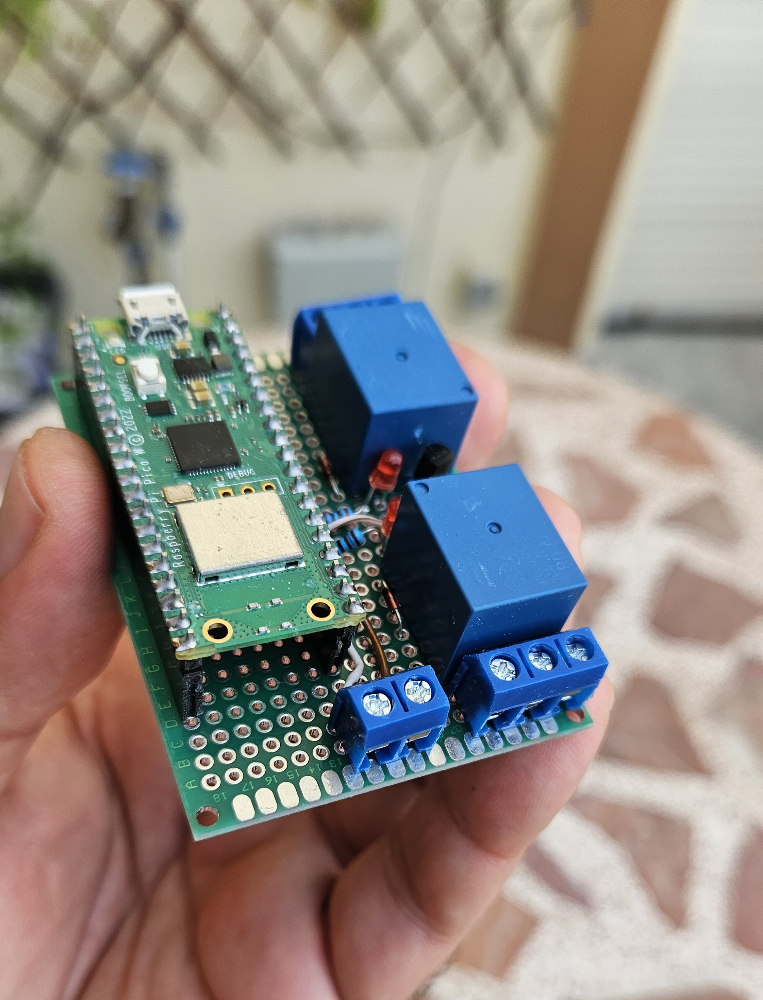
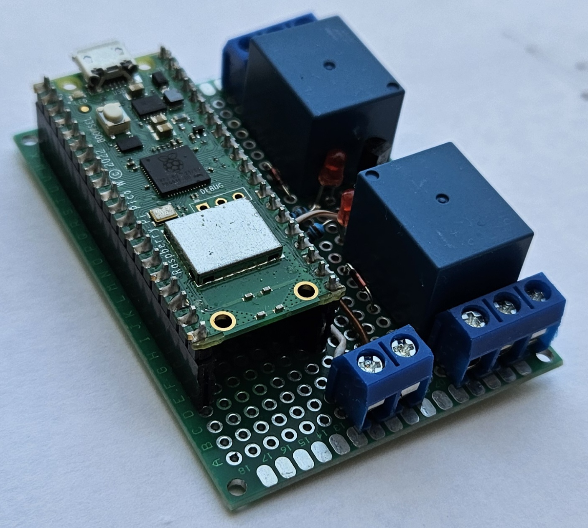
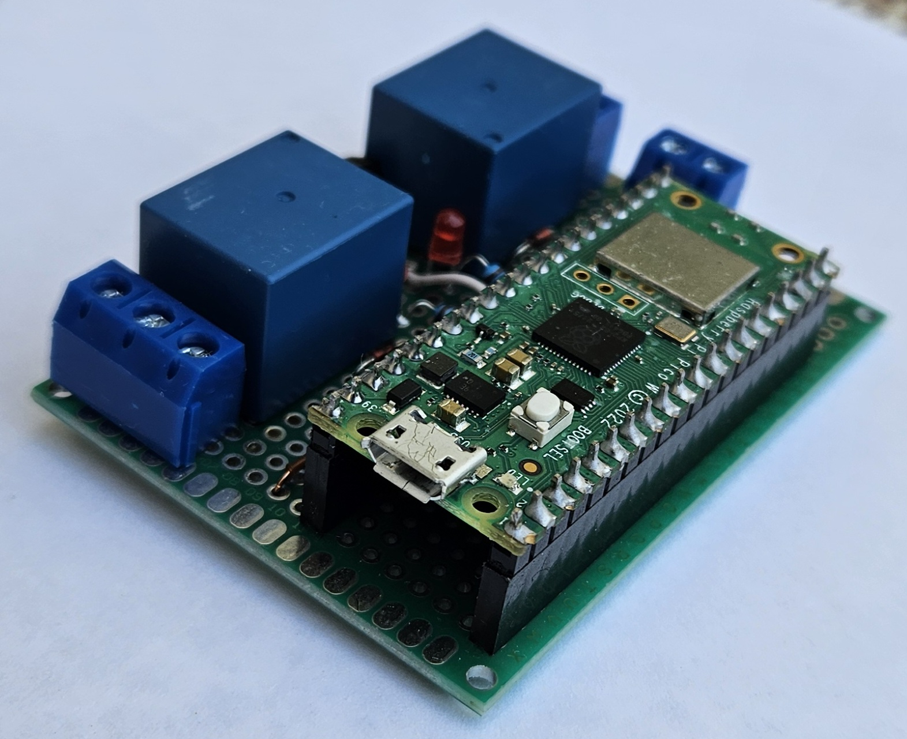
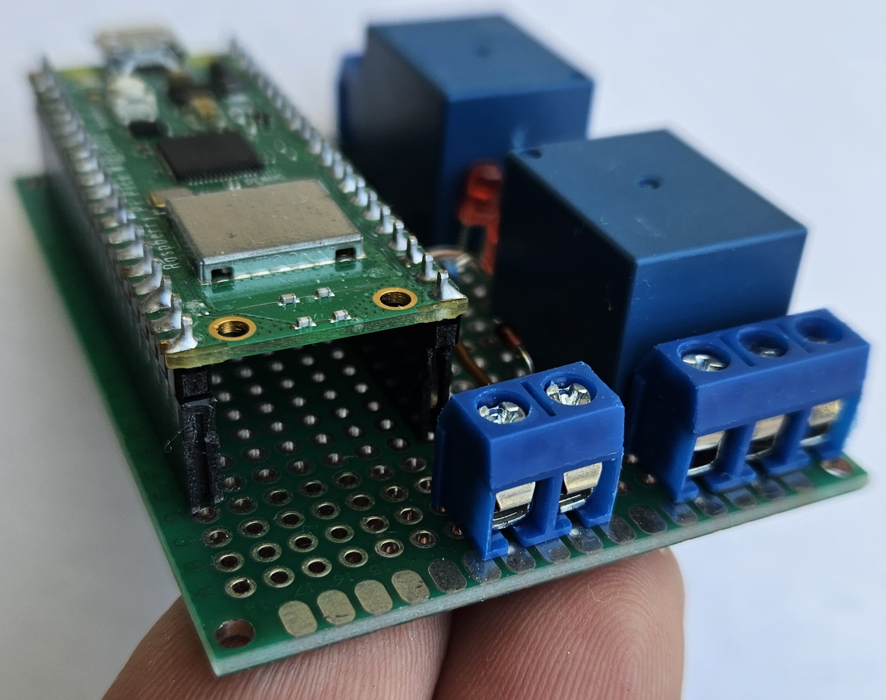
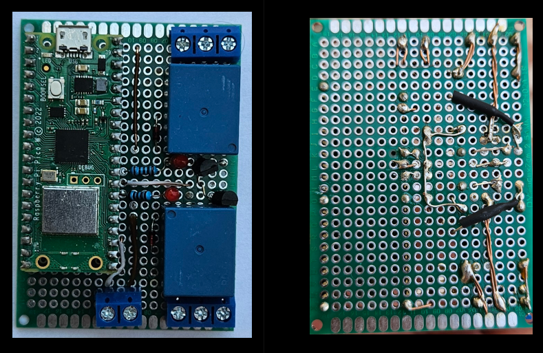

# Drip irrigation controller



## Table of contents

- [Introduction](#introductions)
- [Building instructions](#building-instructions)
- [WiFi connectivity](#wifi-connectivity)
    - [UDP command messages](#udp-command-messages)
- [Directory tree](#directory-tree)
- [Hardware](#harware)

------

## Introduction

This drip irrigation controller was designed to control one relay for a water
electrovalve and a second relay for ornament lights. Both relays may be
configured for independent one-time-a-day activation to remain active during a
configurable time. The frequency in terms of days between activations is also
configurable. Any of the relays may be disabled which will stop their future scheduled activations.



A default configuration is applied at building time (edit files 'CMakeLists.txt',
'timers_default_data.cmake', and 'wlan_setup_data.cmake' to change it). The
controller configuration (get and set) and manual activation may be done
remotely through the wifi connection with simple UDP messages exchange.



This is the second controller I've built for my house plants.
The first was written in Python in a rush before going out on
a trip and worked perfectly. It had a dot matrix screen with
a setup menu through microswitches; a real-time clock module,
etc. But some years later it hangs a lot, outdoor installation
always takes its toll.



So I've decided to implement a new version that loses the screen
in favor of a WiFi connection for keep-alive signaling against
a server, configuration and commands.

This repository includes all the code and scripts to built the
program in a Raspberry Pi Pico (1) W board. The schematics for
the external hardware is also included.

**Luis Luque - 2025**

------

## Building instructions

REMEMBER: This code was made for and tested on a Pico W (first
family of the Raspberry Pi Pico series). Use at your own risk in
other platforms.

Clone repository from:

https://github.com/lluque42/drip_irrigation_controller.git

Two files are included to allow an easy customization:
* wlan_setup_data.cmake.template (rename to wlan_setup_data.cmake)
    * To enter the wifi SSID, password.
* timers_default_data.cmake
* To enter the time of the day, frequency and duration for
the relays activation.

Create a build directory and enter to it:

```bash
drip_irrigation_controller $ mkdir build
drip_irrigation_controller $ cd build
drip_irrigation_controller/build $
```

Once inside, execute cmake against the parent directory (where
the CMakeLists.txt is):

```bash
drip_irrigation_controller/build $ cmake ..
drip_irrigation_controller/build $
```

If no errors occurred, then a Makefile file should have been created
in the build directory. Execute it to build the binaries.

```bash
drip_irrigation_controller/build $ make
```

If everything ok, a number of binary files should've been produced,
among them a drip.elf or drip.uf2 ready to be loaded into the Pico W
board.

For building the tests tool, see the **Wifi connectivity** section.

If some error occur check the pre-requisites:
* The PICO_SDK_VARIABLE environment variable should exist and point to
the root of the pico-sdk directory.
* Is your board really a Pico W (first generation)?
* ?
TODO

------

## WiFi connectivity

The microcontroller can connect to a wireless network if the correct settings
were edited in the wlan_setup_data.cmake file (a template for this file is
provided, just write your settings and rename the file).

A static IPv4 address must be provided, as well as an UDP port (a high
non-common one to avoid issues). This is necessary for the controller to act as
a simple text UDP server. That is, it will open the UDP port listening for
incoming messages. A set of message formats define commands and responses
that may be sent to the controller and back.

The messages are plain-text ASCII, human readable, strings (without the NUL
termination), that is, a string sent as the payload of the UDP datagram.

A simple, dirty client (and a server) written to debug this program is included
as a git sub-module in:

```bash
drip_irrigation_controller/test/udp_tx_rx
```

Since it is a submodule it should be initialized from the
drip_irrigation_controller root directory by doing:

```bash
drip_irrigation_controller $ git submodule update --init --recursive
```

After that, both the client and server can be build with:

```bash
drip_irrigation_controller/test/udp_tx_rx $ make
```

Which places the binaries in the bin folder.

To use the client to communicate over the wifi with  the irrigation controller
(assuming the default values in the wlan_setup_data.cmake.template) just do:

```bash
.../test/udp_tx_rx/bin $ ./udp_client 192.168.1.69 1234
```

This will receive input from the stdin for the user to send text to the
controller.

The commands, their formats, and the expected replies are the following:

------

### UDP command messages

Below are the recognized command messages and their replies. The client
just need to write and read this as the payload of UDP messages to/from
the controller that acts as a server on the IP address and UDP port set
in the wlan_setup_data.cmake at build time.
* Set datetime:
	SET:DATETIME:YYYY:MM:DD:dotw:HH:mm:SS
		dotw: Day of the week 0-6. Sunday is 0.
* Set water timer parameters:
    SET:WATER:WTODHH:WTODmm:WTODSS:WEXD:DOW
        TOD: Time of day when activation should occur.
        EXD: Every X days, the X. Days between activations.
        DO:  Duration of activation.
* Set lights timer parameters:
    SET:LIGHTS:LTODHH:LTODmm:LTODSS:LEXD:DOL
        TOD: Time of day when activation should occur.
        EXD: Every X days, the X. Days between activations.
        DO:  Duration of activation.
* Get datetime:
    GET:DATETIME
        Response example: 2025:8:15:5:21:2:52
        (see SET:DATETIME format).
* Get water relay current configuration:
    GET:WATER
        Response example: 
            21:0:0:1:120:2025:8:15:5:21:0:0
        That is:
            Time of day: 21:0:0
            Every X days: 1
            Duration (sec): 120
            Next activation scheduled: 2025:8:16:6:21:0:0
            (see SET:DATETIME format).
* Get lights relay current configuration:
    GET:LIGHTS 
        Response example:
            21:0:0:1:10800:2025:8:15:5:21:0:0
        See GET:WATER format.
* Manual on lights.
	MANUALON:LIGHTS
* Manual off lights.
	MANUALOFF:LIGHTS
* Manual on water.
	MANUALON:WATER
* Manual off water.
	MANUALOFF:WATER
* Timed on lights (Force turn on for the duration configured).
	TIMEDON:LIGHTS
* Timed on irigation (Force turn on for the duration configured).
	TIMEDON:WATER

For non get commands, expect a response of "done" if it was correctly processed
or a custom human readable error message.

------

## Directory tree

TODO


    ./  
    ├── .gitignore				(to prevent undesired files to be stagged)
    ├── Doxyfile				(doxygen config file for doc generation)  
    ├── Makefile				(use 'make help' for instructions)  
    ├── README.md				(brief documentation)  
    ├── doc/					(documentation extracted from comments in .h)  
    │   ├── html/				(html documentation)  
    │   │   ├── ...  
    │   │   ├── index.html		(entry point for html documentation)  
    │   │   ├── ...  
    │   └── man/				(man pages documentation)  
    │       └── man3/  
    │           └── ...			(example of use: 'man -l ft_string.h.3')  
    ├── include/				(directory for public header files (.h))  
    │   ├── ...  
    │   └── ...  
    ├── src/					(dir for source code and private header files)  
    │   ├── ...  
    │   │   ├── ...  				
    │   │   └── ...  
    │   └── ...					(may be structured in several directories)  
    │       ├── ...  
    │       └── ...  
    ├── lib/					(external libraries)  
    │   ├── ...  
    │   └── libft				(each library in its own directory)  
    ├── bin/					(directory for project's binaries and tester)  
    │   ├── ...  
    │   └── ...					(may be structured in several directories)  
    ├── obj/					(dir for source code and private header files)  
    │   ├── ...  
    │   │   ├── ...  
    │   │   └── ...  
    │   └── ...					(structured as in ./src)  
    │       ├── ...  
    │       └── ...  
    ├── data/					(directory for non-source files)  
    └── test/					(test program src code, compiles to .bin/tester)
        ├── ...  
        ├── tester.c  
        └── ...  

------

## Hardware

TODO



Volts across led: 2,5 V 
	With a 10K resistance and driven through the 2n3904 (100KOhm base to gpio)

With USB 5V directly fed, the relay coil consumes 70mA
	The pico restarts everytime te coil de-energizes, the diode requirement is
	real.


Had to replace the 100K base resistor with a 10K because with the realy coil
current I guess the transistor couldn't remain polarized.
